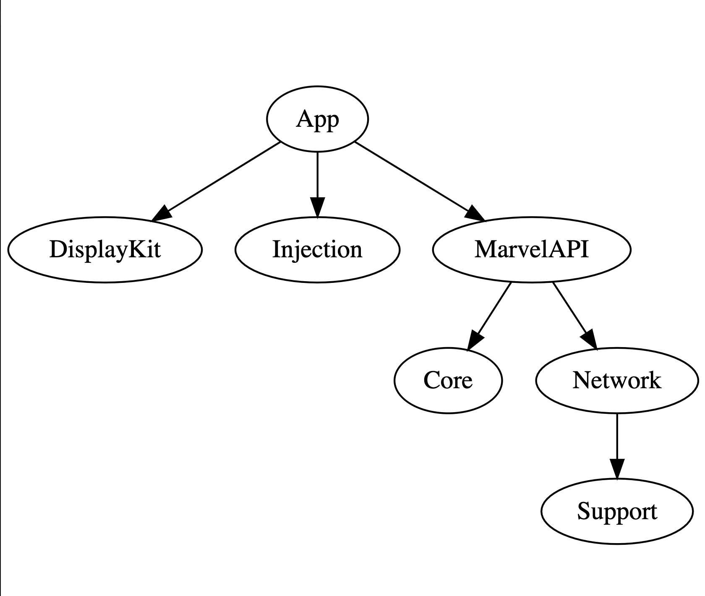

# MARVEL APP

Example marvel master and detail app.
Powered by [Tuist](https://github.com/tuist/tuist).
To run the project you need to install Tuist before. Do it simply running this in your shell:
```
bash <(curl -Ls https://install.tuist.io)
```
and then run `tuist generate` this will generate the project using the tuist bundled version inside the repo.

Tuist it's a tool that help us with the project definition, avoid xcodeproj conflicts, give us a simple way to modularize the app and help us with the dependencies also.

Also, you'll need [Carthage](https://github.com/Carthage/Carthage) installed on your computer. Then run
```
carthage bootstrap --platform iOS
```

You mus't provide your Deleveper Keys on `Environment.swift.template` and remove the `.template` suffix of the file.

## Architecture

**MVVM**

SwiftUI to enjoy and test it.

Combine to have a declarative way to do things without use third party libraries (like Rx or Promises).

Stateful views that repsond to state and outputs actions.

This views can be reusable since you can change the VM and change how its works (this cases are very simple, but you can do this with other kind of views like a password screen view or something like that)

ViewModels handle actions, perform things and updates the state with the new things.

DI with [Injection](https://github.com/julianalonso/Injection)

Using [Navigator](https://jobandtalent.engineering/the-navigator-420b24fc57da) to handle the navigation, this also help us with error messages, allowing this component to handle how errors are shown.

In case that the error must be a view state, the view model has the responsability to check wheter the error must be handled by the view or the navigator.

Also notice that error handling it's very basic, there are no Error threatment to "known errors" inside the app. Only catching the possible errors and showing a default message.

## App Modules



### Core
With our bussiness logic, in this case get heroes from an api.

### MarvelAPI
Wrapper of marvel API.

Marvel api return all object fields optional, I don't like that, so I wrap it with this library and filter only the objects that are "complete".

Our core its abstracted from this by aplying IoC

### DisplayKit
A module with our views.
This module only exposes Views, ViewModel, ViewStates and Actions.

### Network
Simple netowrking client that performs request provided by Endpoints.

### Support
An utility framework.

#### Tests
There are some test under `App/Tests`, this tests are integration test, only to check UseCases flow are working as expected, this means (network, parsing, map from `MarvelAPI.Hero` to `Core.Hero`).

Each module also have a `Test` target under `_Module_/Tests` where you can place your unit tests.
